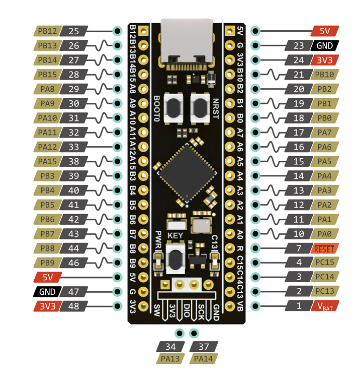
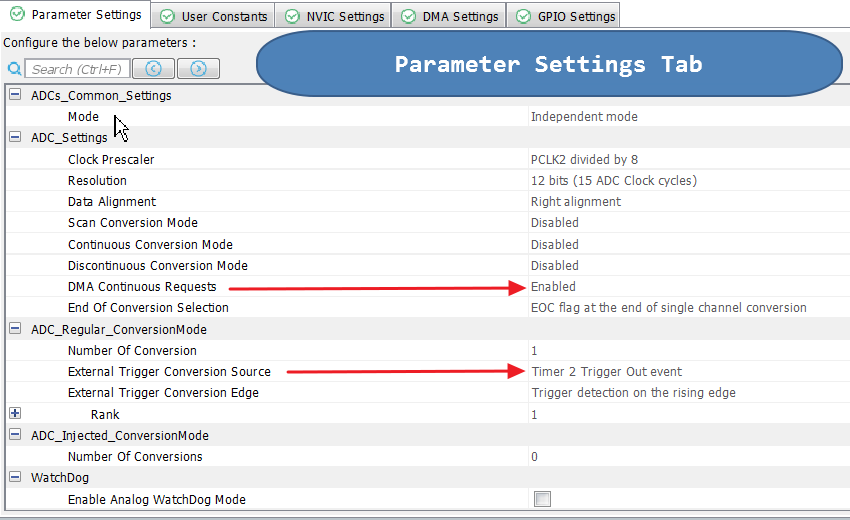
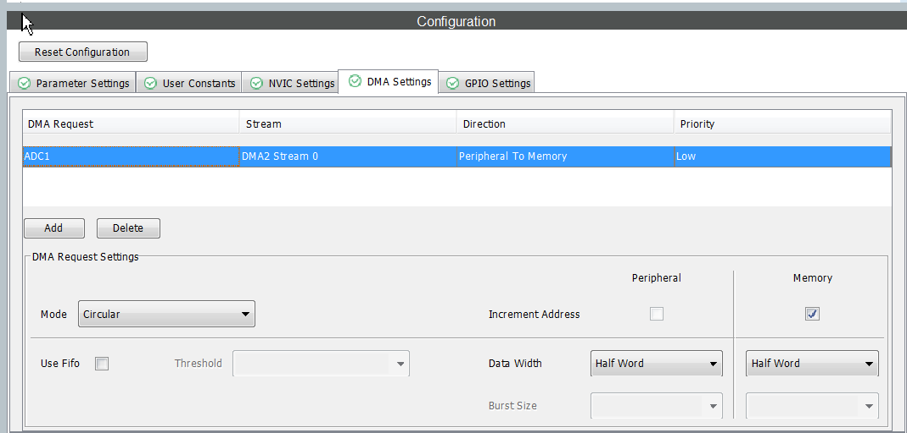
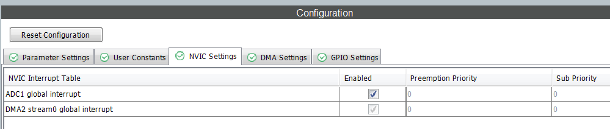
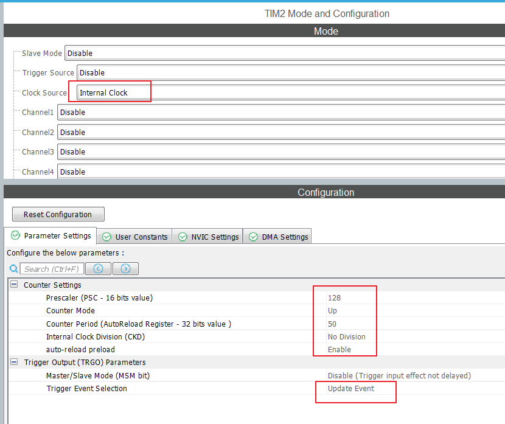

# Timer Triggered ADC-DMA at 10 - 20 Kilo Sample Per Second for audio
BlackPill. STM32F401CCU6 Development Board.
  
### Setup the ADC in CubeMX as follows.  
 
### Setup DMA 
  
### Setup ADC Interrupt (For checking Convertion Rate)
  
### Now setup the TIM2 as follows. Note: Trigger Event Selection Must be set to Update Event.
  