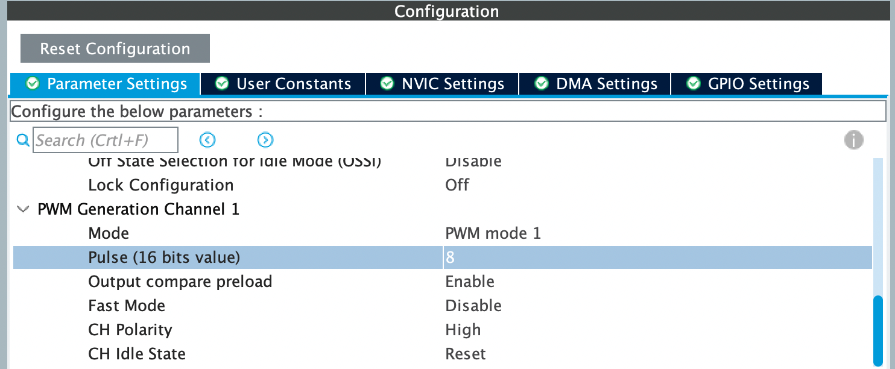

# Timer Triggered ADC-DMA at 10 - 20 Kilo Sample Per Second for audio
BlackPill. STM32F401CCU6 Development Board.
  
Here we use Timer2 EVENT TRIGGER output to trigger the ADC start conversion at a regular interval. 
Now ADC conversion rate is 9 Kilo Sample per second. Check the Timer settings below. We alwyas have 
more options to increase conversion rate. From the document [HERE](https://marcelmg.github.io/pwm_dac_sound/) we can calculate maximum audio frequency
from the conversion rate. 
### Setup the ADC in CubeMX as follows.  
 
### Setup DMA 
  
### Setup ADC Interrupt (For checking Convertion Rate)
  
### Now setup the TIM2 as follows. Note: Trigger Event Selection Must be set to Update Event.
  

___

### We setup the PWM DAC as described in 
[STM32 TIMERS #1. PWM Output || DMA](https://www.youtube.com/watch?v=OwlfFp8fPN0) and  
[STM32CubeIDE basics - 05 TIM PWM HAL lab](https://www.youtube.com/watch?v=-AFCcfzK9xc) 

Configure TIM1 as below.   
 
  
  
### As referenced from  Reference :  [Set up multiple ADCs on STM32 microcontrollers using DMA At Time 1:53](https://youtu.be/AloHXBk6Bfk?t=113) 
it shows multiple ADC input setup in Cube IDE.  
1. Set Number of Conversion = 2 Press Enter 
2. Scan Conversion Mode = Enabled 
3. DMA Settings should be configured as [DMA setup AT 3:48](https://youtu.be/AloHXBk6Bfk?t=228)

[Set up multiple ADCs on STM32 microcontrollers using DMA](https://www.youtube.com/watch?v=AloHXBk6Bfk) 
[STM32CubeIDE basics - 10 ADC DMA TIM HAL lab](https://www.youtube.com/watch?v=pLsAhJ8umJk) 
[create audio signals with PWM STM32F103C8](https://marcelmg.github.io/pwm_dac_sound/) 
[STM32 TIMERS #1. PWM Output || DMA](https://www.youtube.com/watch?v=OwlfFp8fPN0) 
[EmbeddedExpertIO](https://embeddedexpert.io/?p=858&fbclid=IwAR2bhHOcd__Dlb0FOMDrgP93dbdVjOlu2wdS3iJBXY4OYVTGU9i-guuQK3w) 
