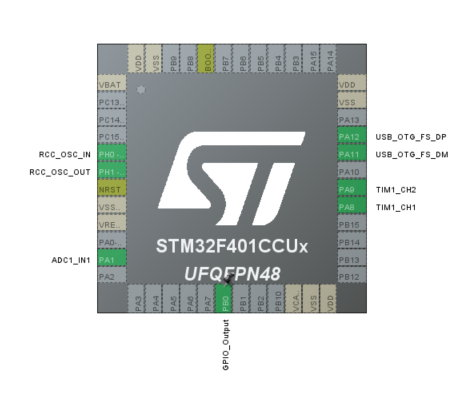
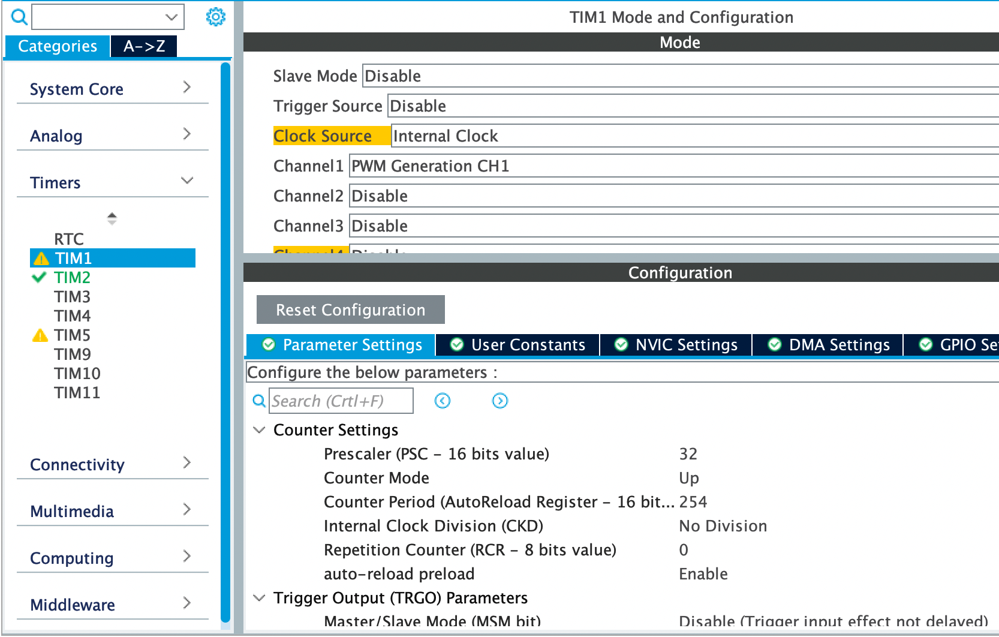

# Timer Triggered ADC-DMA at 10 - 20 Kilo Sample Per Second for audio. Modified for CBTester signal generation.
BlackPill. STM32F401CCU6 Development Board.
  
Here we use Timer2 EVENT TRIGGER output to trigger the ADC start conversion at a regular interval. 
Now ADC conversion rate is 9 Kilo Sample per second. Check the Timer settings below. We alwyas have 
more options to increase conversion rate. From the document [HERE](https://marcelmg.github.io/pwm_dac_sound/) we can calculate maximum audio frequency
from the conversion rate. 
### Setup the ADC in CubeMX as follows.  
 
### Setup DMA 
  
### Setup ADC Interrupt (For checking Convertion Rate)
  
### Now setup the TIM2 as follows. Note: Trigger Event Selection Must be set to Update Event.
  

___

### Special operation for testing CB. ADC A1 is reading current from DC-CT. If the current exceed a limit, it turns up/down a relay.  
Next operation is to generate a sequence of operations on 3 different PWM channels. Initially I choose first channel TIM1_CH1 (PA8) for output.  
So for PWM the timer is TIM1.  
  
  
  
